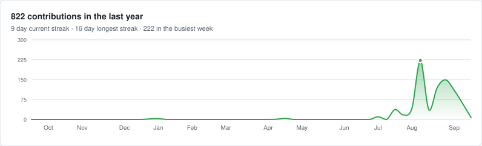

<h2> Hi, I'm Bao Nguyen <br>
A React Native Developer </h2>

###  A little more about me...  

🚀 I'm a React Native Developer with 6+ years of experience in building high-quality and performant mobile applications  
💡 I'm passionate about creating impressive user experiences and writing clean, efficient code  
🔧 I publish native modules for React Native and fix bugs in the libraries I ship with  
📱 I love turning ideas into beautiful, functional mobile applications  
🐕 I absolutely love dogs and I'm a proud owner of 5 adorable poodles! They're my coding companions and stress relievers 

```javascript
const BaoInformation = {
    pronouns: "He" | "Him",
    askMeAbout: ["React Native Development", "Native Modules", "Mobile App Architecture", "UI/UX Design"],
    technologies: {
        frontend: ["React Native", "React", "TypeScript", "JavaScript"],
        native: ["Swift", "SwiftUI", "Objective-C", "Kotlin", "TurboModules", "Fabric"],
        backend: ["Node.js", "Express"],
        database: ["MongoDB", "MySQL", "Firebase"],
        tools: ["Expo", "React Native CLI", "Redux", "Context API", "TanStack"],
        design: ["Figma", "Adobe XD"],
        others: ["Git", "GitHub", "GitLab", "Bitbucket", "Jira", "VS Code", "Xcode", "Android Studio"]
    },
    currentFocus: "Open source native modules for the New Architecture",
    funFact: "I debug with console.log and I'm not ashamed! 😄",
    personalLife: "Dog lover with 5 poodles 🐩 - they're the best debugging partners!"
}
```

##  My Tech Stack 

### Mobile Development


### Native


### State Management & APIs


### Core Integrations


### Payments


### Security


### Deployment


### Development Tools


##  Open Source Contributions

**122 pull requests to 55 external projects.** Every fix starts with a root-cause investigation and a regression test that fails without the patch.

<p align="left">
  
  
  
  
</p>

### Merged upstream, into 21 projects

<table>
<tr>
<td valign="top" width="34%">

| Project | PRs |
|:--|--:|
| [react-native-skia](https://github.com/Shopify/react-native-skia/pulls?q=is%3Apr+author%3AgiaBaoJS) | `6` |
| [rnx-kit](https://github.com/microsoft/rnx-kit/pulls?q=is%3Apr+author%3AgiaBaoJS) | `4` |
| [svelte](https://github.com/sveltejs/svelte/pulls?q=is%3Apr+author%3AgiaBaoJS) | `4` |
| [hot-updater](https://github.com/gronxb/hot-updater/pulls?q=is%3Apr+author%3AgiaBaoJS) | `3` |
| [react-hook-form](https://github.com/react-hook-form/react-hook-form/pulls?q=is%3Apr+author%3AgiaBaoJS) | `2` |
| [datetimepicker](https://github.com/react-native-datetimepicker/datetimepicker/pulls?q=is%3Apr+author%3AgiaBaoJS) | `2` |
| [expo](https://github.com/expo/expo/pulls?q=is%3Apr+author%3AgiaBaoJS) | `2` |

</td>
<td valign="top" width="33%">

| Project | PRs |
|:--|--:|
| [react-native-gesture-handler](https://github.com/software-mansion/react-native-gesture-handler/pulls?q=is%3Apr+author%3AgiaBaoJS) | `1` |
| [unocss](https://github.com/unocss/unocss/pulls?q=is%3Apr+author%3AgiaBaoJS) | `1` |
| [quasar](https://github.com/quasarframework/quasar/pulls?q=is%3Apr+author%3AgiaBaoJS) | `1` |
| [mantine](https://github.com/mantinedev/mantine/pulls?q=is%3Apr+author%3AgiaBaoJS) | `1` |
| [nuxt/icon](https://github.com/nuxt/icon/pulls?q=is%3Apr+author%3AgiaBaoJS) | `1` |
| [tiptap](https://github.com/ueberdosis/tiptap/pulls?q=is%3Apr+author%3AgiaBaoJS) | `1` |
| [ant-design](https://github.com/ant-design/ant-design/pulls?q=is%3Apr+author%3AgiaBaoJS) | `1` |

</td>
<td valign="top" width="33%">

| Project | PRs |
|:--|--:|
| [react-native-vision-camera](https://github.com/margelo/react-native-vision-camera/pulls?q=is%3Apr+author%3AgiaBaoJS) | `1` |
| [react-native-iconify](https://github.com/huytdps13400/react-native-iconify/pulls?q=is%3Apr+author%3AgiaBaoJS) | `1` |
| [react-native-fast-tflite](https://github.com/margelo/react-native-fast-tflite/pulls?q=is%3Apr+author%3AgiaBaoJS) | `1` |
| [margelo/nitro](https://github.com/margelo/nitro/pulls?q=is%3Apr+author%3AgiaBaoJS) | `1` |
| [PackageList](https://github.com/SwiftPackageIndex/PackageList/pulls?q=is%3Apr+author%3AgiaBaoJS) | `1` |
| [heroui-native](https://github.com/heroui-inc/heroui-native/pulls?q=is%3Apr+author%3AgiaBaoJS) | `1` |
| [react-native-bottom-sheet](https://github.com/software-mansion-labs/react-native-bottom-sheet/pulls?q=is%3Apr+author%3AgiaBaoJS) | `1` |

</td>
</tr>
</table>

### Under review, in 42 projects

<table>
<tr>
<td valign="top" width="34%">

| Project | PRs |
|:--|--:|
| [react-native-paper](https://github.com/callstack/react-native-paper/pulls?q=is%3Apr+author%3AgiaBaoJS) | `6` |
| [eas-cli](https://github.com/expo/eas-cli/pulls?q=is%3Apr+author%3AgiaBaoJS) | `5` |
| [tiptap](https://github.com/ueberdosis/tiptap/pulls?q=is%3Apr+author%3AgiaBaoJS) | `3` |
| [ant-design](https://github.com/ant-design/ant-design/pulls?q=is%3Apr+author%3AgiaBaoJS) | `3` |
| [reactotron](https://github.com/infinitered/reactotron/pulls?q=is%3Apr+author%3AgiaBaoJS) | `3` |

</td>
<td valign="top" width="33%">

| Project | PRs |
|:--|--:|
| [react-native-unistyles](https://github.com/jpudysz/react-native-unistyles/pulls?q=is%3Apr+author%3AgiaBaoJS) | `3` |
| [react-native-safe-area-context](https://github.com/appandflow/react-native-safe-area-context/pulls?q=is%3Apr+author%3AgiaBaoJS) | `3` |
| [prettier](https://github.com/prettier/prettier/pulls?q=is%3Apr+author%3AgiaBaoJS) | `2` |
| [repack](https://github.com/callstack/repack/pulls?q=is%3Apr+author%3AgiaBaoJS) | `2` |
| [expo](https://github.com/expo/expo/pulls?q=is%3Apr+author%3AgiaBaoJS) | `2` |

</td>
</tr>
</table>

<a href="https://github.com/search?q=is%3Apr+author%3AgiaBaoJS+is%3Aopen&type=pullrequests"></a>

<sub>Counts verified from the GitHub API on September 3, 2026. "Landed via maintainer PR" is a change a maintainer folded into their own pull request and credited with a <code>Co-authored-by</code> trailer, so it shipped even though this pull request shows as closed. Closed pull requests are counted in the total rather than hidden.</sub>

<br>

##  Libraries I've Published

Native modules for the New Architecture, plus one SwiftUI package. All MIT, all with example apps and CI.

| Library | What it does | |
| :-- | :-- | :-- |
| **[react-native-device-pulse](https://github.com/giaBaoJS/react-native-device-pulse)** | Device health from JS: thermal state, low power mode, memory warnings. Event listeners and React hooks. | [](https://www.npmjs.com/package/react-native-device-pulse) |
| **[react-native-app-shortcuts](https://github.com/giaBaoJS/react-native-app-shortcuts)** | Home screen quick actions. `UIApplicationShortcutItem` on iOS, `ShortcutManager` on Android. | [](https://www.npmjs.com/package/@giabaojs/react-native-app-shortcuts) |
| **[react-native-shared-transition](https://github.com/giaBaoJS/react-native-shared-transition)** | Shared element transitions between screens. Revived and rewritten, with the first working iOS build in the project's history. | [](https://www.npmjs.com/package/react-native-shared-transition) |
| **[react-native-tipkit](https://github.com/giaBaoJS/react-native-tipkit)** | Apple's TipKit for React Native: popover and inline tips, display rules, event counts, frequency control. | [](https://www.npmjs.com/package/@giabaojs/react-native-tipkit) |
| **[react-native-image-analysis](https://github.com/giaBaoJS/react-native-image-analysis)** | On-device OCR with text geometry, barcodes, and a tap-to-select text view. Apple VisionKit on iOS, Google ML Kit on Android. | [](https://www.npmjs.com/package/react-native-image-analysis) |
| **[react-native-ios-controls](https://github.com/giaBaoJS/react-native-ios-controls)** | Control Center, Lock Screen and Action Button controls (iOS 18 `ControlWidget`), plus a CLI that wires up the widget target for you. | [](https://www.npmjs.com/package/react-native-ios-controls) |
| **[ToastKit](https://github.com/giaBaoJS/ToastKit)** | A polished SwiftUI toast and snackbar library: queued toasts, semantic styles, swipe-to-dismiss, full accessibility. | [](https://giabaojs.github.io/ToastKit/documentation/toastkit/) |

##  Activity Graph
<picture>
  <source media="(prefers-color-scheme: dark)" srcset="./assets/activity-graph-dark.svg">
  
</picture>

<sub>Rendered from the GitHub API and committed to this repo by <a href="./.github/workflows/activity-graph.yml">a weekly workflow</a>, so it does not depend on a third party staying online.</sub>

##  Let's Connect

<div align="center">
  <a href="mailto:giabaofrontend@gmail.com"></a>
  <a href="https://www.linkedin.com/in/baonguyenrn/"></a>
  <a href="https://x.com/BNguyen86186"></a>
  <br /><br />
  <em><b>I love connecting with different people</b>, so if you want to say <b>hi, I'll be happy to meet you!</b> 😊</em>
</div>

---
<div align="center">
  
</div>
